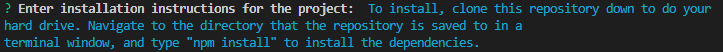

<base target="_blank">

# README Generator

<a href="#description">Description</a> •
<a href="#key-features">Key Features</a> •
<a href="#installation">Installation</a> •
<a href="#usage">Usage</a> •
<a href="#technologies-used">Technologies Used</a> •
<a href="#concepts-demonstrated">Concepts Demonstrated</a> •
<a href="#author">Author</a>

-------------------------------------------------------

[Video Demo on YouTube](https://youtu.be/AdBSUeU4BeE)

[Same Demo on GitHub](./demo/README-generator-demo.mp4) (You'll have to download this demo as it's too big to be shown by GitHub)

-------------------------------------------------------

## Description

This program generates a README after the user answers a series of prompts through the command line using the inquirer package. The answers are then used to generate the README. The series of prompts are:

                   
                  
                 
                 
               
                
                 
       
       

The generated README has the title that the user entered in the title prompt under the H1 heading at the top of the README:        
       

Then, a badge is generated for the license that the user selected in the license prompt and placed under the title:               
       

If no license is selected in the license prompt, no badge is generated or added.        
Then, a table of contents is generated with links to the Description, Installation, Usage, Contributing, Tests, License, and Questions sections of the generated README:                       
             

The description section comes below the table of contents, and is an h2 heading with the title of Description (## Description). Under the heading in the description section is the description of the application that the user entered in the description prompt:                    
          

Under the description section is the installation section, which is an h2 header with the title of Installation (## Installation). In the installation section, under the header is the installation instructions that the user entered in installation prompt:           
          

Under the installation section is the usage section, which is an h2 with the title of Usage (## Usage). In the usage section under the usage header is the usage information that the user entered in the usage prompt:                            
                   

Under the usage section is the contributing section, which is an h2 header with the title of Contributing (## Contributing). In the contributing section under the header is the contribution guidelines for the project that the user entered in the contributing prompt:                
                   

Under the contributing section is the tests section, which is an h2 header with the title of Tests (## Tests). In the tests section under the header are the tests for the application that the user entered in the tests prompt:                             
                   

Under the tests section is the license section, which is an h2 header with the title of License (## License). Under the header in the license section is a short note about what license this application is covered under and a link for more information about the license the user chose in the license prompt:                    
                   

If no license was chosen in the license prompt, nothing is shown under the header in the license section. Finally, under the license section is the questions section, which is an h2 header with the title of Questions (## Questions). In the questions section under the header is the note "If you have any questions you can reach me at: "; a link to a github profile for the github username that the user entered in the username prompt; and a mailto link to an email address the user provided in the e-mail prompt:               
                   

## Key Features

- Generate a README with a license badge, table of contents, clearly defined sectional content, and a link the user's github repository and email address.

## Installation

- Clone this repository down to your hard drive.
- Make sure [node.js](https://nodejs.org/en/) and the npm package manager are both installed.
- Navigate to the directory that you cloned the repo down to and type `npm install` to install all dependencies.

## Usage

- Navigate using a command line interface to the directory the repo was cloned into in the installation step.
- Type `node index.js` in the command line.
- Answer the prompts.
- The README is generated as generated-README.md so as not to conflict with the README.md in the current directory. Copy over the generated-README.md to your project directory and rename it README.md.

## Technologies Used

- [Inquirer Package](https://www.npmjs.com/package/inquirer)
- [node.js](https://nodejs.org/en/)
- [JavaScript](https://www.javascript.com/)

## Concepts Demonstrated

- The use of node.js
- Installing and using node.js packages using npm.
- Writing to a file using JavaScript.
- General JavaScript and programming knowledge.

## Author

Adam Ferro
- [Github](https://github.com/GeminiAd)
- [Linked-In](https://www.linkedin.com/in/adam-ferro)